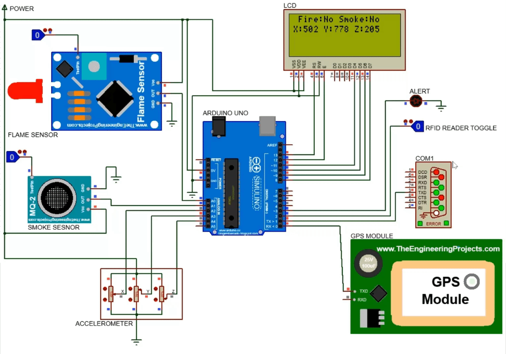

# Onboard-Railway-Monitoring-System

## Block Diagram
The on-board monitoring device is design to function as a combination of two different systems. It uses RFID technology to send the current location of the train at some intervals of time. It is also designed to act as a disaster management system, where in case of an accident or derailment or any other emergency scenario, the live location of the train is being send to the main control server along with other necessary authorities using GPS to aid in the emergency response and rescue operations. It makes use of an accelerometer, a flame sensor, and a smoke sensor to detect any anomalies for the disaster management system. A block diagram of the proposed model is given below along with a brief explanation of the major components to be used in the development of the said model.

## Working Principle
The on-board monitoring device is designed to fulfil two objectives, one is to continuously send the current location of the moving train using RFID technology and the second is to act as a disaster management system. The working principles of the two systems is discussed is brief in the subsections below along with a complete workflow diagram of the proposed model.

## Proteus Design
The circuit diagram for the proposed on-board monitoring system is designed and simulated using Proteus. The Arduino UNO microcontroller is used for the control of the system. 

## Simulation
All testing and simulation for the proposed on-board monitoring device is done using Proteus, Arduino IDE, Virtual Serial Port Emulator, Python and XAMPP. To run the simulations - 
<ol>
  <li>Install XAMPP and start the Apache and the phpMyAdmin servers</li>
  <li>Create a new database 'hsr' and import the 'hsr.sql' file</li>
  <li>Install VSPE and start a virtual 'COM1' serial port</li>
  <li>Launch the 'script.py' Python script and keep it running in the background</li>
  <li>Open the Proteus design file and start the simulation</li>
  <li>Change the sensor vaules accordingly for different results</li>
</ol>
